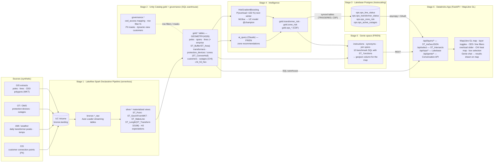

# Grid Genie — Architecture Blueprint

End-to-end, governed, spatially native prototype for a distribution utility: Lakeflow ingestion → Unity Catalog
medallion with native `GEOMETRY` → ML / AI Functions → Lakebase operational serving → bilingual Genie space →
Databricks App with MapLibre GL.

## Design decisions

| Topic | Decision | Why |
|---|---|---|
| Geometry storage | `GEOMETRY(4326)` in silver and gold. Bronze keeps the raw lon/lat and WKT, as landed | Native spatial types, so no WKT strings or float pairs downstream. Bronze stays a faithful copy of the source |
| Metric computations | `ST_Transform(geom, 32198)` (NAD83 / Québec Lambert) before `ST_Length`, `ST_Area`, `ST_Distance`, `ST_Buffer`, `ST_DWithin` | Gives correct metres and m² for Québec, where lon/lat degrees would distort |
| Topology | Each pole carries its `parent_pole_id`. Spans are built with `ST_MakeLine(parent, child)`. Network distance is a cumulative sum along the branch plus the lateral's tap offset | Supports both straight-line and along-the-line distance to the substation |
| Protection zones | One zone per device. A COUPE-CIRCUIT protects one lateral, a DISJONCTEUR the whole feeder. Shape = `ST_Buffer(ST_ConvexHull(ST_Union_Agg(poles)), 30 m)` | Answers "customers affected if X fails" exactly, and gives a polygon for the map |
| Right-of-way (emprise) | `ST_Buffer(line, 15 m)` in EPSG:32198, area via `ST_Area` | Standard 30 m distribution corridor, adjustable in one place |
| PII | Text masks on name and address. Location goes through the dynamic view `gold.customers`, which generalises points to the H3 res-8 centre for anyone outside `grid_genie_pii_readers` | UC column masks don't support GEOMETRY. Analytics still works because distances are precomputed from exact geometry |
| Row-level security | `governance.ced_row_filter(ced_code)` on `customers_pii` and `outages`, driven by the `governance.ced_access` mapping (users, SPs, account groups → CED or `*`) | Operating-centre scoping without hard-coding groups in the function |
| Lakebase | Synced tables (TRIGGERED, CDF, one shared pipeline) from `gold.ops_*`. These carry scalar lon/lat because synced tables don't support GEOMETRY | Millisecond reads for the operational panels. Delta stays the system of record |
| ML | Train on Hiver 2025 features → label Hiver 2026 (>150 %). Score Hiver 2026 → Hiver 2027 | Honest temporal split that predicts the coming winter from the last one |
| Genie → map | Instruction plus examples make Genie add `ST_AsGeoJSON(geom) AS geojson`. The app also parses WKT and lon/lat columns | Every answer that refers to a location can be drawn on the map |

## Data model (gold)

| Table | Grain | Key spatial columns |
|---|---|---|
| `operating_centers` | CED (LAV, BCE, MAT) | `geom` POLYGON, `area_km2` |
| `substations` | poste | `geom` POINT |
| `lines` | ligne | `geom` MULTILINESTRING, `right_of_way_geom` POLYGON, `right_of_way_area_m2`, `max_distance_to_substation_m` |
| `poles` | poteau | `geom`, `distance_to_substation_m`, `network_distance_m`, `h3_cell_9` |
| `spans` | portée | `geom` LINESTRING, `length_m` |
| `transformers` | transformateur | `geom`, `max_overload_pct_hiver_2025/2026`, `zone_id` |
| `transformer_load_daily` | transformer × day | `overload_pct`, `winter_label` |
| `protection_devices` | coupe-circuit / disjoncteur | `geom`, `customers_downstream` |
| `protection_zones` | zone | `zone_geom`, `interruptions_3m/6m`, `chi_3m/6m` |
| `customers` (view) / `customers_pii` | client | `geom` (generalised in view), `distance_to_substation_m` |
| `outages` | interruption | `fault_geom`, `chi`, `is_ongoing` |
| `chi_h3_hex` | H3 res-8 cell | `geom` hexagon, `chi_6m` |
| `transformer_risk`, `zone_risk` | ML / AI outputs | — (join to geometry tables) |
| `ops_*` | Lakebase serving | scalar `lon`, `lat` |
